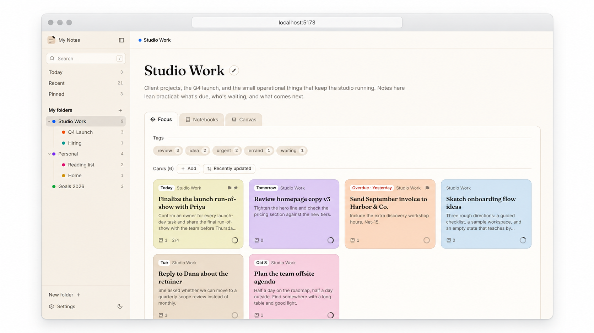
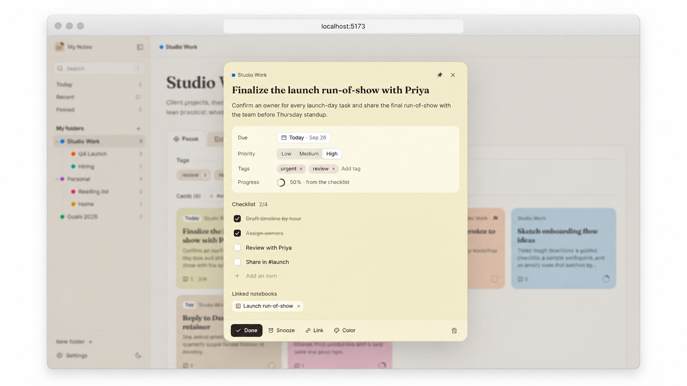
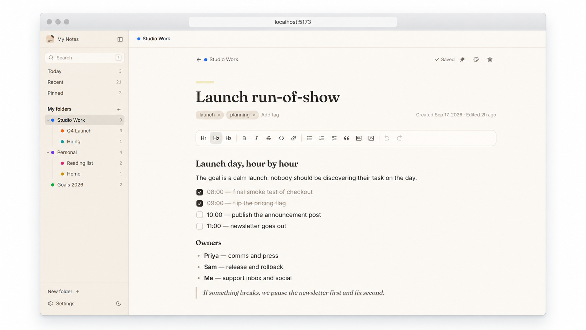
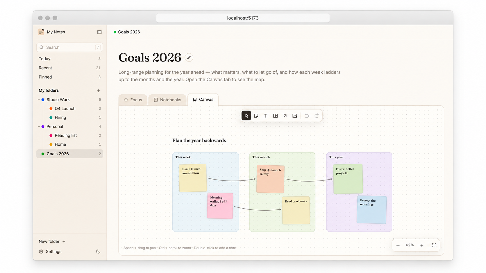

<p align="center">
  <strong>NOTEKEEPER</strong>
</p>

<h1 align="center">A quiet desk for your notes and plans</h1>

<p align="center">
  Quick to-dos, long-form writing, and big-picture planning, organized in folders.<br>
  It runs in your browser and keeps everything on your device.
</p>

<p align="center">
  
  
  
</p>

<p align="center">
  <picture>
    <source media="(prefers-color-scheme: dark)" srcset="docs/assets/mockup-hero-dark.png">
    
  </picture>
</p>

## What is Notekeeper?

Notekeeper is a personal notes and planning app for people who want their to-dos, writing, and goals in one calm place, without the weight of a project-management tool.

Everything lives in folders. Each folder has three views of the same work: **Focus** for small things that need attention soon, **Notebooks** for longer writing, and **Canvas** for mapping out plans visually. There's no account and no server; your notes are saved in your browser.

## Features

### Focus

Short cards for the things that need you soon. Each card has a due date, tags, a priority, a checklist that drives its progress ring, and a pastel color you choose. Filter by tag, sort by due date or priority, and mark cards done to move them out of the way.

<p align="center">
  <picture>
    <source media="(prefers-color-scheme: dark)" srcset="docs/assets/mockup-focus-dark.png">
    
  </picture>
</p>

### Notebooks

Longer notes live in notebooks, with headings, checklists, quotes, code blocks, links, and images. Changes save as you type, and cards can link to the notebooks they relate to.

<p align="center">
  <picture>
    <source media="(prefers-color-scheme: dark)" srcset="docs/assets/mockup-notebooks-dark.png">
    
  </picture>
</p>

### Canvas

An open canvas for planning. Add sticky notes, group them into sections like *This week*, *This month*, and *This year*, and draw connectors between them. Sections carry their notes when you move them, connectors follow along, and undo works for everything.

<p align="center">
  <picture>
    <source media="(prefers-color-scheme: dark)" srcset="docs/assets/mockup-canvas-dark.png">
    
  </picture>
</p>

Around all three: nested folders you can drag into order, search across everything, Today / Recent / Pinned views, keyboard shortcuts, and light and dark themes that follow your system.

## How it works

<p align="center">
  <strong>01</strong><br>
  <strong>Make a folder</strong> for each area of your work or life.<br>
  Nest them, color them, and drag them into order.
</p>

<p align="center">↓</p>

<p align="center">
  <strong>02</strong><br>
  <strong>Capture</strong> small things as cards in Focus and longer thinking in Notebooks.<br>
  Link cards to the notes they belong to.
</p>

<p align="center">↓</p>

<p align="center">
  <strong>03</strong><br>
  <strong>Plan</strong> on the Canvas.<br>
  Lay goals out by week, month, and year, and connect them.
</p>

Everything is saved to your browser's `localStorage` as you go. Use **Settings → Export** to download a JSON backup and **Import** to restore one. Clearing your browser's site data deletes your notes, so export first.

## Getting started

You'll need [Node.js](https://nodejs.org) 20.19+ or 22.12+.

```bash
git clone https://github.com/Harshul1484/Notekeeper.git
cd Notekeeper
npm install
npm run dev
```

Open http://localhost:5173. The app starts with a few sample folders so you can look around; **Settings → Sample data** restores them at any time.

### Keyboard shortcuts

- `N` — new card, notebook, or sticky note in the current tab
- `/` — search
- `Esc` — close the open card, menu, or notebook
- On the canvas: `Space` + drag to pan, `Ctrl`/`⌘` + scroll to zoom, `Ctrl`/`⌘` + `Z` to undo (add `Shift` to redo), `Backspace` to delete, and `V` `S` `T` `F` `A` to switch tools

## Development

```bash
npm run dev        # start the dev server
npm run build      # typecheck and build to dist/
npm run preview    # serve the production build
npm run typecheck  # run TypeScript only
```

Built with React 19, TypeScript, Vite, Tailwind CSS 4, Zustand, TipTap, react-day-picker, Radix UI, and Remix Icon.

```text
src/
  components/   UI by area: layout, folder, focus, notebooks, canvas, ui
  store/        app data and UI state (Zustand), persisted to localStorage
  data/seed.ts  sample content for first launch
  index.css     design tokens for the light and dark themes
```
