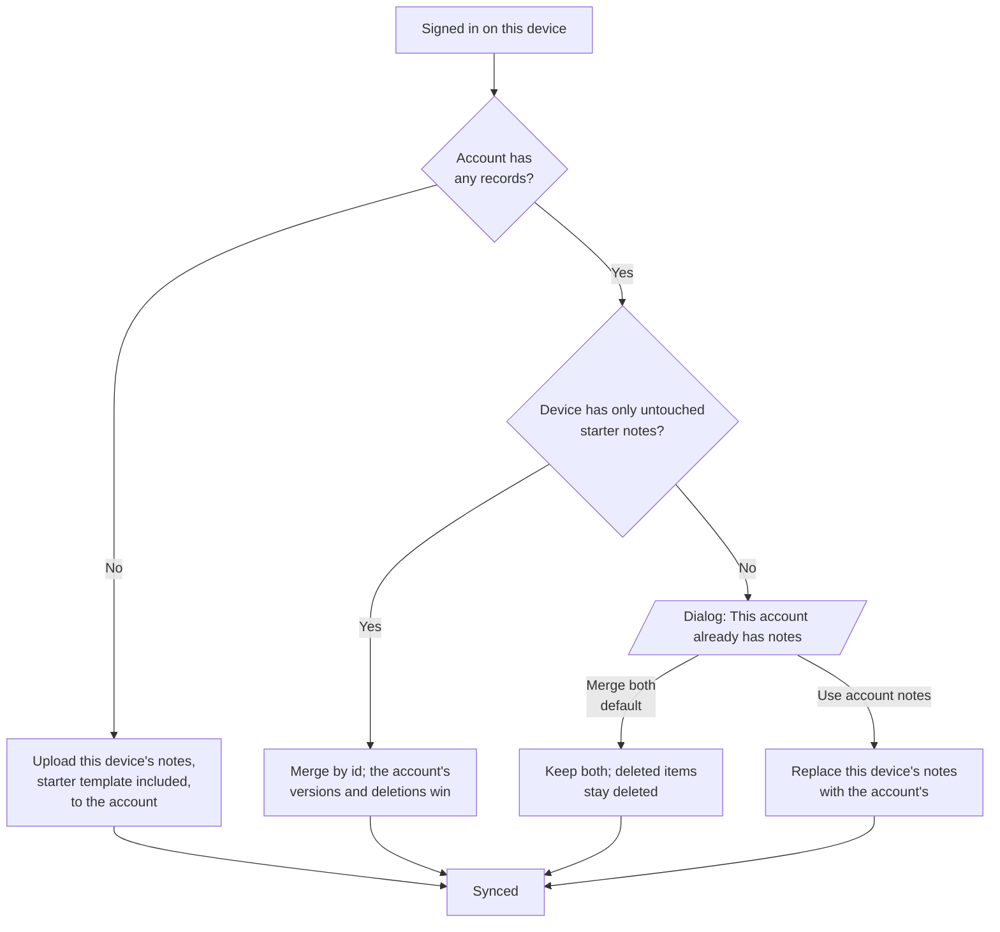
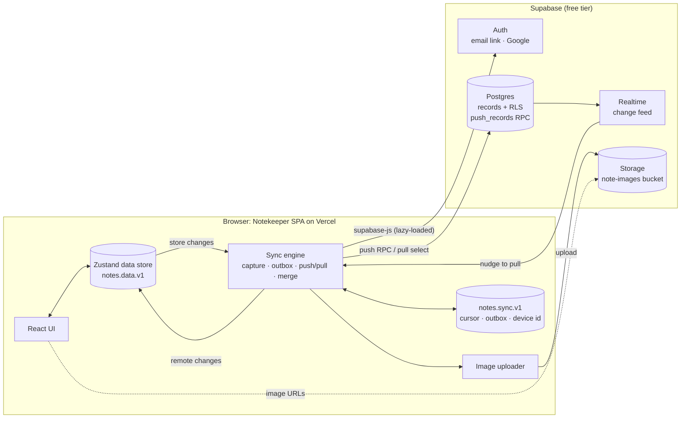
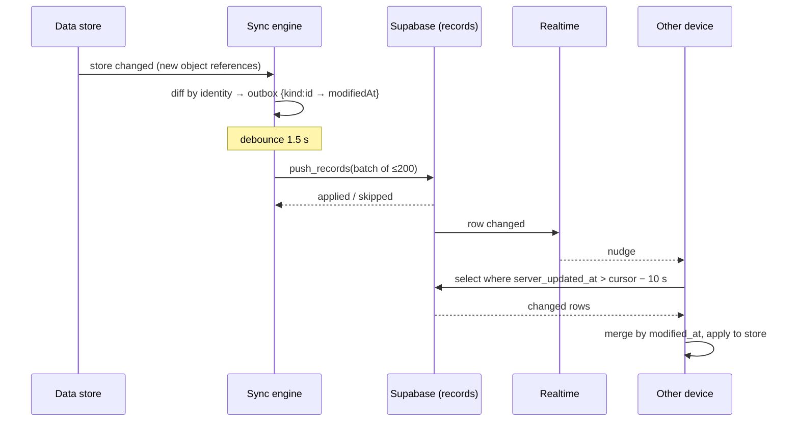

# Notekeeper Cloud Sync: Product Requirements

| | |
| --- | --- |
| Status | Draft for review |
| Owner | Harshul Rathod |
| Last updated | 2026-09-29 |
| Decision needed | Approve the v1 scope ([Functional requirements](#6-functional-requirements), [Rollout](#15-rollout-plan)) and answer the [open questions](#16-risks-open-questions-and-alternatives) |

## Contents

1. [Summary](#1-summary)
2. [Background and problem](#2-background-and-problem)
3. [Goals, non-goals, and success metrics](#3-goals-non-goals-and-success-metrics)
4. [Users and user stories](#4-users-and-user-stories)
5. [User experience](#5-user-experience)
6. [Functional requirements](#6-functional-requirements)
7. [Architecture](#7-architecture)
8. [Data model](#8-data-model)
9. [Sync protocol](#9-sync-protocol)
10. [Images](#10-images)
11. [Security and privacy](#11-security-and-privacy)
12. [Non-functional requirements](#12-non-functional-requirements)
13. [Setup and operations](#13-setup-and-operations)
14. [Test plan and acceptance criteria](#14-test-plan-and-acceptance-criteria)
15. [Rollout plan](#15-rollout-plan)
16. [Risks, open questions, and alternatives](#16-risks-open-questions-and-alternatives)

---

## 1. Summary

Notekeeper gets optional accounts that sync folders, cards, notebooks, canvas items and images across devices, built on Supabase's free tier. The app stays local-first: every edit lands on the device instantly and syncs in the background, and it keeps working fully offline. Without Supabase keys configured, the app behaves exactly as it does today.

- **Backend:** Supabase Auth (an emailed sign-in link, plus optional Google), one Postgres `records` table protected by row-level security, Supabase Storage for images, and Realtime to nudge other devices.
- **Client:** a sync engine beside the existing Zustand store. It captures changes, queues them in an outbox, pushes and pulls, and resolves conflicts per record by last write wins.
- **Starter template:** stored in the database as ordinary records, so every account starts with it and every device receives it from the account.
- **Cost:** $0 at personal scale. The owner creates the Supabase project and adds two environment variables to Vercel.

## 2. Background and problem

Today every note lives only in one browser's `localStorage`, so it is stuck on one device and gone if that storage is cleared. Notekeeper is a static single-page app on Vercel with no server. Its data layer is one Zustand store (`src/store/data.ts`) persisted under the key `notes.data.v1` (schema version 4). UI preferences persist separately under `notes.ui.v1`.

| Problem | Why it happens today | Impact |
| --- | --- | --- |
| No access from a second device | Data exists only in the browser that created it | Phone and laptop show different notes |
| Data loss | Clearing site data, a private window, or a new browser wipes `localStorage` | Everything is gone, unless the user exported a backup by hand |
| Tight storage | Browsers give an origin about 5 MB of `localStorage` (approximate; varies by browser) | A few images fill it, and saves then fail |
| Small images | Images are stored inline as base64 data URLs, capped at 2 MB each (`MAX_IMAGE_BYTES` in `src/lib/images.ts`) | Photos must be shrunk before adding |
| Manual backup only | Settings offers JSON export and import | Backups are rare and quickly stale |

The JSON export and import in Settings stay as they are; sync does not replace them.

## 3. Goals, non-goals, and success metrics

v1 succeeds when a signed-in person sees the same notes on every device within seconds and never loses a note to cleared browser storage.

### Goals

1. The same folders, cards, notebooks, canvas items and images on every device signed in to one account.
2. Notes survive clearing site data, a new browser, or a lost device.
3. Images move to cloud storage, so they stop filling `localStorage`. The per-image cap rises from 2 MB to 10 MB when signed in.
4. Local-first stays intact: no click, keystroke or navigation waits on the network, and the app works offline.
5. $0 running cost for personal use, on managed services only (no server to operate).
6. Signed-out and unconfigured use stays exactly as it is today.

### Non-goals for v1

- Sharing notes or folders with other people, or real-time co-editing.
- End-to-end encryption (notes are readable by the database operator).
- Version history or undo across devices.
- Native mobile apps; the web app in a phone browser is the mobile story.
- Server-side search; search stays on the device.
- Syncing UI preferences (theme, expanded folders, canvas viewports).

### Success metrics

| Metric | Target | How measured |
| --- | --- | --- |
| An edit on device A visible on device B (both online) | p95 under 5 s | Two-browser end-to-end test, 50 runs |
| First sync of 1,000 records to a new device | Under 10 s | End-to-end test with generated data |
| Data loss across the test matrix | 0 records | Offline, conflict and sign-out scenarios in the [Test plan](#14-test-plan-and-acceptance-criteria) |
| Interactions blocked on the network | 0 | Code review, plus profiling of typing and navigation |
| Free-tier usage for one heavy user (5,000 records, 300 images) | Under 25% of any limit | Supabase usage dashboard |
| Extra JavaScript on first load when signed out | 0 KB | The sync client loads lazily; checked with a bundle report |

## 4. Users and user stories

The primary user is one person with two or three devices, typically a laptop and a phone, who wants their notes everywhere without thinking about it. The second audience is anyone deploying their own copy of Notekeeper; setup should take them under 30 minutes.

| As a… | I want to… | So that… |
| --- | --- | --- |
| Person with a laptop and a phone | sign in once on each device | my notes are the same everywhere |
| Person writing on a train | keep editing with no connection | nothing blocks me, and it syncs when I'm back online |
| Person who cleared their browser | sign in again | all my notes come back |
| Person already using Notekeeper locally | sign in for the first time | my existing notes upload instead of vanishing |
| Person signing in on a second device that has its own notes | choose whether to merge or to use the account's notes | I don't end up with duplicates or lost work |
| Person adding photos to notebooks | add images up to 10 MB | I don't resize photos first, and my device storage doesn't fill up |
| Person on a shared computer | sign out and remove my notes from it | the next person can't read them |
| Person glancing at the sidebar | see whether everything is synced | I can close the tab with confidence |
| Person leaving the service | export everything and delete my account | my data is portable and fully removed |
| Owner deploying their own copy | follow a short setup guide | sync works on my Vercel deploy without writing code |

## 5. User experience

Sync lives in one new **Account** section at the top of Settings, plus a small status icon in the sidebar footer; nothing else in the app changes. When Supabase is not configured, neither appears.

### Signing in

1. Settings → Account shows "Sync your notes across devices", an email field, **Send sign-in link**, and **Continue with Google** (only when Google is enabled).
2. After sending, it shows "Check your email. The link signs you in on this device." plus **Use a different email**.
3. The link opens Notekeeper, which finishes signing in and starts the first sync on its own.
4. An expired or already-used link shows "That sign-in link has expired. Send a new one." in the Account section.

### The first sync on a device

What happens depends on whether the account and the device already hold notes:



- The starter template is stored in the database like any other notes ([The starter template in the database](#the-starter-template-in-the-database)). A brand-new account therefore gets it from the first device that signs in, and every later device receives it from the account.
- "Untouched starter notes" means every item matches the seed from `createSeed()` by id and content, so nothing the person wrote is ever silently replaced. Because starter items have the same ids on every device, they merge into the account's copies instead of duplicating, and starter items deleted on another device stay deleted.
- The dialog offers **Download a backup first**, which runs the existing JSON export.
- While the first sync runs, the Account section shows progress ("Uploading 214 of 530…"), and the app stays usable.

### Signed in

- The Account section shows the email, a status line ("Synced · 2 minutes ago"), **Sync now**, **Sign out**, and **Delete account**.
- The sidebar footer gets a cloud icon beside Settings, with a tooltip:

| State | Icon | Tooltip text |
| --- | --- | --- |
| Synced | Cloud with a check | Synced · 2 minutes ago |
| Syncing | Cloud with arrows | Syncing 3 changes… |
| Offline | Cloud with a slash | Offline · changes will sync when you're back online |
| Server paused | Cloud with a pause mark | Sync server is asleep · your notes are safe on this device |
| Error | Cloud with an alert | Couldn't sync · click to retry |

### Signing out

1. **Sign out** first pushes pending changes.
2. If some changes are still unsynced (for example, offline), it asks: "3 changes haven't synced yet. Sign out anyway? They'll be lost." with **Cancel** and **Sign out anyway**.
3. Signing out removes the account's notes from this device and restores a local-only copy of the starter folders, so a shared computer keeps nothing private. The account's own copy of the template is untouched.

### Deleting the account

A two-step confirm ("Delete account and all synced notes?", then typing the email) deletes all records, images and the sign-in. The device returns to the starter folders.

### Images

When signed in and online, pasted, dropped and uploaded images go straight to cloud storage, up to 10 MB each. Signed out or offline, they are stored inline as today (2 MB cap) and move to the cloud on the next sync.

## 6. Functional requirements

P0 is the v1 release; P1 follows in the same milestone if time allows; P2 comes later. The IDs are referenced from the [Test plan](#14-test-plan-and-acceptance-criteria).

| ID | Requirement | Priority |
| --- | --- | --- |
| AUTH-1 | Sign in with an emailed one-time link (Supabase magic link, PKCE flow). | P0 |
| AUTH-2 | The session persists across reloads and refreshes its token silently. An expired session asks the person to sign in again without touching local notes. | P0 |
| AUTH-3 | Sign in with Google, shown only when `VITE_AUTH_GOOGLE=true`. | P1 |
| AUTH-4 | Sign out pushes pending changes, warns if some remain unsynced, then clears account data from the device and restores the starter folders. | P0 |
| AUTH-5 | Delete account removes all records, stored images and the auth user, after a typed-email confirm. | P1 |
| SYNC-1 | Every create, update and delete of a folder, card, notebook or canvas item is captured without changing the store's actions. | P0 |
| SYNC-2 | Captured changes queue in a persistent outbox and push within 2 s of the last edit while online. | P0 |
| SYNC-3 | Remote changes are pulled on start, on focus, on reconnect, on a Realtime nudge, and every 60 s while the tab is visible. | P0 |
| SYNC-4 | Conflicts resolve per record by last write wins on the edit's timestamp; ties break by device id. | P0 |
| SYNC-5 | Deletes propagate as tombstones, so a deleted item never comes back from another device. | P0 |
| SYNC-6 | Full offline use; the outbox survives reloads and flushes on reconnect. | P0 |
| SYNC-7 | First sign-in on a device follows the upload, use-account and merge rules in [User experience](#the-first-sync-on-a-device). | P0 |
| SYNC-8 | When a remote edit overwrites an unsynced local notebook edit, the local version is kept as a copy titled "Launch plan (conflict)" (the notebook's own title + "(conflict)"). | P1 |
| SYNC-9 | Only one browser tab syncs at a time (Web Locks API); other tabs reload data when it changes. | P1 |
| SYNC-10 | Tombstones older than 90 days are purged; a device whose cursor is older than that does a full resync. | P1 |
| SYNC-11 | The starter template is written to the database as ordinary records on an account's first link, merges by id on later devices, and syncs every edit and deletion like user notes ([details](#the-starter-template-in-the-database)). | P0 |
| IMG-1 | While signed in and online, new images upload to Storage, and the note stores the image URL. The cap is 10 MB. | P0 |
| IMG-2 | Existing inline (base64) images in notebooks and on the canvas upload during sync and are replaced by URLs, locally and remotely. | P0 |
| IMG-3 | Images no longer referenced by any note are deleted from Storage by a monthly job. | P2 |
| UI-1 | An Account section in Settings with the states in [User experience](#5-user-experience). | P0 |
| UI-2 | A sidebar sync-status icon with the five states and their tooltips. | P0 |
| UI-3 | The merge-or-replace dialog on first sign-in, with a backup download. | P0 |
| UI-4 | Progress for a first sync over 100 records. | P1 |
| DEV-1 | With no Supabase env vars, the app builds and runs local-only, with no account UI and no sync code loaded. | P0 |
| DEV-2 | A SQL migration file in the repo creates the whole backend in one run. | P1 |
| DEV-3 | A local Supabase stack (Docker) for development and integration tests. | P2 |

## 7. Architecture

The browser stays the source of truth for what the person sees. Supabase is a durable copy that each device reconciles with, never a server the UI waits on.



| Component | Responsibility | Notes |
| --- | --- | --- |
| Zustand data store | Holds and persists notes, as today | Its actions and API stay unchanged; sync observes it |
| Sync engine (`src/sync/`) | Change capture, outbox, push, pull, merge, first-link rules, status | Runs in one tab at a time (P1) |
| Image uploader | Uploads new images; migrates base64 images found in outgoing records | Caches content hash → URL so an image uploads once |
| Supabase Auth | Magic link and Google sign-in; issues JWTs | Session kept by supabase-js in `localStorage` |
| Postgres `records` | The durable copy of every item, with tombstones | RLS scopes every row to its owner |
| `push_records` RPC | Conditional upsert (last write wins) in one round trip | `security invoker` |
| Realtime | Tells other devices that something changed | A nudge only; data always arrives through a pull |
| Storage `note-images` | Image files | Public read with unguessable paths ([Images](#10-images)) |

**Configuration gate.** Sync turns on only when both `VITE_SUPABASE_URL` and `VITE_SUPABASE_PUBLISHABLE_KEY` are set at build time. Without them the account UI is hidden and `@supabase/supabase-js` is never loaded (DEV-1). With them, the client loads in a separate chunk the first time the Account section opens or a stored session is found.

**Why Realtime is only a nudge.** Applying changes from one path (pull) keeps merging, cursors and conflict handling in one place. A Realtime event just schedules a pull 500 ms later, and missed events cost nothing because the 60 s and on-focus pulls catch up.

## 8. Data model

All four collections sync through one table, `records`, holding each item's full JSON plus the few columns sync needs. The client already owns the schema and does all querying, so typed columns would add migrations without adding capability, while one table keeps push and pull to one code path. The cost is no server-side foreign keys (for example, card → folder), which the app already tolerates.

### Table `public.records`

| Column | Type | Notes |
| --- | --- | --- |
| `user_id` | `uuid` not null, default `auth.uid()` | References `auth.users(id)` on delete cascade |
| `kind` | `text` not null | Check: `folder`, `card`, `notebook`, `canvas_item` |
| `id` | `text` not null | The app's own id. Starter ids such as `f-start` repeat across users, hence the composite key |
| `data` | `jsonb` not null | The item exactly as the store holds it; `{}` for a tombstone |
| `deleted` | `boolean` not null, default `false` | Tombstone flag |
| `modified_at` | `bigint` not null | Client time of the edit in ms; the last-write-wins key |
| `modified_by` | `text` not null | Random device id; tie-break and echo detection |
| `server_updated_at` | `timestamptz` not null | Set to `clock_timestamp()` by a trigger on every insert and update; the pull cursor |

- Primary key `(user_id, kind, id)`; index on `(user_id, server_updated_at)` for pulls.
- A check keeps `data` under 1 MB, so images must be URLs, not base64, in synced records.

Sketch of the migration (`supabase/migrations/0001_sync.sql`):

```sql
create table public.records (
  user_id           uuid        not null default auth.uid() references auth.users (id) on delete cascade,
  kind              text        not null check (kind in ('folder', 'card', 'notebook', 'canvas_item')),
  id                text        not null,
  data              jsonb       not null default '{}'::jsonb check (pg_column_size(data) < 1048576),
  deleted           boolean     not null default false,
  modified_at       bigint      not null,
  modified_by       text        not null,
  server_updated_at timestamptz not null default clock_timestamp(),
  primary key (user_id, kind, id)
);
create index records_pull_idx on public.records (user_id, server_updated_at);

create function public.touch_server_updated_at() returns trigger language plpgsql as $$
begin new.server_updated_at := clock_timestamp(); return new; end $$;
create trigger records_touch before insert or update on public.records
  for each row execute function public.touch_server_updated_at();

alter table public.records enable row level security;
create policy "own rows: read"   on public.records for select using (user_id = auth.uid());
create policy "own rows: insert" on public.records for insert with check (user_id = auth.uid());
create policy "own rows: update" on public.records for update using (user_id = auth.uid()) with check (user_id = auth.uid());
create policy "own rows: delete" on public.records for delete using (user_id = auth.uid());
revoke all on public.records from anon;

alter publication supabase_realtime add table public.records;
```

### Push function `public.push_records(changes jsonb) returns jsonb`

- `security invoker`, so row-level security applies to every row it touches.
- For each change: insert, or on conflict update only when `excluded.modified_at > records.modified_at`, or when they are equal and `excluded.modified_by > records.modified_by`.
- Returns `{ applied: [keys], skipped: [keys], server_time }`. A skipped row means a newer version already exists, which the next pull delivers.
- Limit: 200 changes and 2 MB per call; the client batches.

```sql
insert into public.records as r (user_id, kind, id, data, deleted, modified_at, modified_by)
select auth.uid(), c.kind, c.id, c.data, c.deleted, c.modified_at, c.modified_by
from jsonb_to_recordset(changes) as c(kind text, id text, data jsonb, deleted boolean, modified_at bigint, modified_by text)
on conflict (user_id, kind, id) do update
  set data = excluded.data, deleted = excluded.deleted,
      modified_at = excluded.modified_at, modified_by = excluded.modified_by
  where (excluded.modified_at, excluded.modified_by) > (r.modified_at, r.modified_by)
returning r.kind, r.id;
```

### Account deletion

`public.delete_my_account()` is `security definer`. It checks that `auth.uid()` is not null, deletes the caller's Storage objects under `<uid>/`, then deletes the auth user; the records go with it through the cascade.

### The starter template in the database

The starter template from `src/data/seed.ts` is written to `records` as ordinary rows, one per folder, card, notebook and canvas item, under each user's own `user_id`. It isn't a special table or flag: once in the account, the person edits, moves and deletes starter items exactly like their own, and every change syncs.

| Aspect | Behavior |
| --- | --- |
| When it is written | On the first link of any device to an empty account ([9.6](#96-first-link-of-a-device-to-an-account)), pushed from the device's local copy of `createSeed()` |
| What is written | 5 folders, 4 cards, 3 notebooks and the 12 Goals canvas items, as the device holds them (including any edits made before signing in) |
| Ids | The fixed seed ids (`f-start`, `f-work`, `f-projects`, `f-personal`, `f-goals`, `c-welcome`, `n-guide`, `cv-b-now` and so on), unique per user through the `(user_id, kind, id)` key |
| Relative due dates | Written with the dates the device computed at first launch; they don't shift later, matching today's local behavior |
| A second device signs in | Its untouched local template merges into the account's copies by id, so there are no duplicates; the account's versions win |
| Starter items deleted on one device | Stay deleted everywhere, because the tombstone beats the other device's local copy (`modifiedAt = 0` on merge) |
| Settings → **Reset** (sample data) while signed in | Replaces the account's notes on all devices: every current item becomes a tombstone and a fresh template is pushed. The confirm text changes to "Replace your notes on all your devices with the sample folders?" |
| Signing out | Restores the template locally only, as a local-only copy; it isn't written anywhere until the device signs in again |
| Template changes in a future release | Existing accounts keep their copy, as local data does today. The existing `upgradeGoalsCanvas` rule keeps running on each device, and its result syncs like any edit. |

Writing the template from the client, rather than seeding it in SQL, keeps one source of truth (`seed.ts`) and avoids keeping a SQL copy in step with it. A server-side seed is listed under [Alternatives](#alternatives-considered).

### Storage bucket `note-images`

- Public read, a 10 MB object limit, and MIME types `image/png`, `image/jpeg`, `image/gif` and `image/webp`.
- Object path `<user_id>/<random uuid>.<ext>`. Policies allow insert, update and delete only where the first folder of the path equals `auth.uid()`.

### On the device (`localStorage`)

| Key | Holds | Synced |
| --- | --- | --- |
| `notes.data.v1` | Notes, in the unchanged format | Yes, through `records` |
| `notes.ui.v1` | Theme, expanded folders, canvas viewports | No (v1) |
| `notes.sync.v1` | User id, device id, pull cursor, outbox, last sync time, image-upload cache | No |
| `sb-<project>-auth-token` | The Supabase session (supabase-js default) | No |

## 9. Sync protocol

Each device keeps an outbox of changed item keys and a cursor into the server's change log, and reconciles the two by record-level last write wins.



### 9.1 Change capture

- The engine subscribes to `useData`. Store actions replace arrays and changed objects immutably, so for each collection it compares the previous and next arrays by object identity.
- A new or changed object (identity differs and the JSON differs) becomes an outbox entry `{ kind, id, modifiedAt: Date.now() }`. An id missing from the next array becomes a tombstone entry.
- Writes that come from a pull are applied with a flag set, so they are not captured again.
- The outbox stores keys only. The record's data is read from the store at push time, so ten quick edits to one card push once.
- `setFolderCanvas` replaces a folder's items; unchanged items keep their identity, and the JSON check filters out copies that didn't change.

### 9.2 Push

1. Runs 1.5 s after the last captured change, on `visibilitychange` to hidden, on reconnect, and after a pull.
2. Takes up to 200 outbox entries, uploads any base64 images inside them ([Images](#10-images)), and calls `push_records`.
3. On success, removes each entry whose `modifiedAt` has not changed since the batch was taken; newer edits stay queued.
4. On a network or 5xx error, it retries with exponential backoff (1 s, 2 s, 4 s … capped at 60 s). A 401 refreshes the session once, then shows the Error state.

### 9.3 Pull

1. Selects `records` where `server_updated_at > cursor − 10 s`, ordered by `server_updated_at`, 1,000 per page, until empty.
2. For each row: if the outbox holds the same key with a newer `modifiedAt`, it skips the row (the local edit wins and will push). Otherwise it applies the row (an upsert, or a removal for a tombstone) and drops any older outbox entry.
3. It then sets the cursor to the largest `server_updated_at` seen.
4. The 10 s overlap covers transactions that commit out of timestamp order. Applying a row twice changes nothing, so the overlap is safe.

Pull triggers: sign-in and app start, window focus, `online`, a Realtime nudge (debounced 500 ms), every 60 s while visible, and **Sync now**.

### 9.4 Conflicts

| Case | Result |
| --- | --- |
| Same item edited on two devices | The later `modified_at` wins the whole record; ties go to the higher device id |
| Edit on A, delete on B | The later action wins: a later delete removes it, and a later edit brings it back |
| Losing side had an unsynced notebook edit | The local version is saved as "Launch plan (conflict)" (the notebook's own title + "(conflict)") beside the winner (SYNC-8, P1) |
| Card linked to a notebook deleted elsewhere | The link is dropped on apply, as `deleteNotebook` already does locally |
| Folder deleted elsewhere while this device added a card to it | The card is kept and moved to the first root folder, and the status tooltip says so once |

Record-level last write wins is a deliberate v1 simplification. It is correct for cards, folders and canvas items, which are small and rarely edited on two devices at once. Notebooks are the risk, handled by conflict copies (P1) and noted in [Risks](#16-risks-open-questions-and-alternatives).

### 9.5 Tombstones and full resync

- Deletes are written as `deleted = true` with `data = {}`, so every device learns about them.
- A scheduled job (`pg_cron`, daily) removes tombstones older than 90 days (SYNC-10).
- If a device's cursor is older than 90 days, it runs a full resync: pull everything, then treat any local item the server lacks as new only if its `modifiedAt` is newer than the cursor. Otherwise it was deleted elsewhere and is removed.

### 9.6 First link of a device to an account

- **Account empty (no rows, not even tombstones):** every local item, starter template included, enters the outbox with `modifiedAt = now`. From then on the account holds the template.
- **Device has only untouched starter notes:** handled like **Merge both**, with no dialog. Starter items collapse into the account's copies by id, the account's edits and tombstones win, and nothing is duplicated.
- **Merge both:** local items enter the outbox with `modifiedAt = 0`. Any version the server holds, including a tombstone, therefore wins, and only items the server has never seen are added.
- **Use account notes:** local data is replaced by a full pull; the outbox starts empty.

### 9.7 Multiple tabs (P1)

One tab holds a Web Lock (`notekeeper-sync`) and runs the engine. Other tabs listen for the `storage` event on `notes.data.v1` and rehydrate the store, which also fixes today's gap where two open tabs overwrite each other.

## 10. Images

Images leave `localStorage` for Supabase Storage, which lifts the per-image cap to 10 MB and frees device storage.

| Situation | What happens |
| --- | --- |
| Signed in, online, new image | Uploaded first; the notebook or canvas stores its public URL. Over 10 MB is refused with the existing error message style. |
| Signed out, new image | A base64 data URL, as today; 2 MB cap |
| Signed in but offline, new image | A base64 data URL (2 MB cap), replaced by a URL on the next push |
| Existing base64 images after first sign-in | Found in outgoing records (`` in notebook HTML, canvas `image` items), uploaded, and replaced in the store and the record |
| Same image pasted twice | Uploaded once: a SHA-256 of the bytes maps to the stored URL in `notes.sync.v1` |
| Image removed from a note | The file stays until the monthly cleanup (IMG-3, P2) |
| Account deleted | The whole `<uid>/` folder is deleted |

**Privacy trade-off.** The bucket is public-read with random 122-bit paths (`crypto.randomUUID()`). Anyone holding an image's URL can view it, but URLs can't be guessed or listed. A private bucket would need signed, expiring URLs rewritten into TipTap and canvas content at render time, which v1 avoids. It is an [open question](#16-risks-open-questions-and-alternatives) whether that trade is acceptable.

## 11. Security and privacy

Row-level security is the whole security boundary: the browser holds only the publishable key, and every row and file is scoped to `auth.uid()`.

| Threat | Mitigation |
| --- | --- |
| Someone reads another user's notes with the public key | RLS on `records` and Storage policies; the RPC runs as the caller. Integration test: user B cannot read, update or delete user A's rows. |
| Service-role key leak | Never used by the client and never committed; only the publishable key is set in Vercel |
| Image URL guessing | Random UUID paths; bucket listing is disabled for `anon` |
| Account takeover by email | Magic-link only (no passwords); links are single-use and expire. Supabase's default expiry is 1 hour (approximate; configurable). |
| Session theft through XSS | Notes render through TipTap's schema (no raw HTML execution); no third-party scripts beyond Google Fonts CSS. A content security policy is a P2 follow-up. |
| Sign-in link opened on a shared computer | Sign out clears account data from the device |
| Open redirect in the auth flow | Supabase redirect allowlist limited to the production domain, Vercel preview URLs and `http://localhost:5173` |

**Auth redirect handling.** `useUrlSync` calls `history.replaceState` on load, which would strip the `?code=` that PKCE needs. The auth callback must be handled before URL sync runs: the app exchanges the code first (or `useUrlSync` skips the replace while `code` is present), then routes normally.

**Privacy.** Notes are stored unencrypted in the owner's Supabase project; the owner, as project admin, can read them. The Settings Account section states this in one line. Export stays available at any time, and **Delete account** removes everything server-side.

## 12. Non-functional requirements

| Area | Requirement |
| --- | --- |
| Responsiveness | No UI path awaits the network. Store writes stay synchronous; sync work is async and batched. |
| Latency | An edit reaches another online device in p95 under 5 s (1.5 s debounce + push + Realtime + pull) |
| Bundle size | Signed-out first load unchanged. `@supabase/supabase-js` (roughly 45–55 KB gzipped, approximate) loads in its own chunk only when needed. |
| Reliability | Outbox persisted on every change; exponential backoff; a pull is idempotent; no partial writes (the RPC is one statement) |
| Offline | Unlimited offline editing. The outbox is bounded only by `localStorage`; the status icon shows Offline. |
| Record size | Up to 1 MB per record (DB check). Notebooks above 900 KB show a warning before saving. |
| Scale target | 10,000 records and 1,000 images per user without degrading sync time |
| Accessibility | The status icon has an `aria-label`; dialogs use the existing Radix `Modal`; all states reachable by keyboard |
| Browsers | Current Chrome, Edge, Firefox and Safari, including iOS Safari (Web Locks is available in all four) |

### Free-tier constraints

These are approximate; check them against Supabase's pricing page at setup time.

| Resource | Free limit (approximate) | Expected personal use |
| --- | --- | --- |
| Database | 500 MB | Under 20 MB for 10,000 text records |
| Storage | 1 GB | About 300 MB for 300 photos at 1 MB |
| Monthly active users | 50,000 | 1 to 5 |
| Egress | A few GB per month | Well under, since images are cached by the browser |
| Built-in auth email | A small hourly limit meant for testing | Enough for one person; use custom SMTP for anything more |
| Inactivity | The project pauses after about 1 week with no requests | Daily use keeps it awake. If paused, the app shows "Server paused" and keeps working locally; the owner restores it from the dashboard. |

## 13. Setup and operations

The owner can set up sync in under 30 minutes without writing code.

### One-time setup

1. Create a Supabase project (free plan), choosing the region nearest to you.
2. In the SQL editor, run `supabase/migrations/0001_sync.sql`. It creates the table, trigger, RLS policies, RPCs, the Realtime publication, the Storage bucket and its policies, and the daily tombstone job.
3. Auth → URL configuration: set the Site URL to the production Vercel URL. Add redirect URLs for the production domain, `https://*-<team>.vercel.app/**` for previews, and `http://localhost:5173/**`.
4. Auth → Providers: keep Email on, with magic link. Optionally enable Google with a Google Cloud OAuth client ID and secret.
5. Recommended: Auth → SMTP with a custom provider, so sign-in emails aren't rate-limited.
6. Vercel → Project → Settings → Environment Variables: add `VITE_SUPABASE_URL` and `VITE_SUPABASE_PUBLISHABLE_KEY` (plus `VITE_AUTH_GOOGLE=true` if Google is on) for Production and Preview, then redeploy.
7. Local development: put the same variables in `.env.local` (already git-ignored), or run a local stack with `npx supabase start` (Docker).

### Operations

- **Monitoring:** the Supabase dashboard (usage, API and Auth logs). The client logs sync errors to the console, with the last error shown in the Account section.
- **Backups:** the free plan has no point-in-time recovery. Every device's local copy plus the JSON export are the backups; a weekly `pg_dump` via GitHub Actions is a P2 option.
- **Schema changes:** new fields live inside `data` and need no migration. The store's persist `migrate` keeps handling shape changes on each device.
- **Pause recovery:** restore the project from the dashboard; devices catch up on their next pull.

## 14. Test plan and acceptance criteria

Sync logic is tested against an in-memory fake of the backend, and security and end-to-end behavior against a real local Supabase.

| Layer | Tool | Covers |
| --- | --- | --- |
| Unit | Vitest, with an in-memory `Remote` fake | Change capture (SYNC-1), outbox coalescing, last write wins and ties (SYNC-4), tombstones (SYNC-5), the pull overlap, first-link rules (SYNC-7), image extraction (IMG-2) |
| Integration | Vitest against `supabase start` (Docker) | RLS isolation between two users, `push_records` conditional update, Storage path policies, `delete_my_account` |
| End to end | Playwright, two browser contexts on one account | Live sync, offline and reconnect, conflicts, sign-out, images, first-link dialog |
| Manual | A phone and a laptop on the production deploy | Magic link on mobile mail apps, iOS Safari, a paused project |

### Acceptance criteria (v1 ships when all pass)

- [ ] With no env vars, the build is byte-for-byte unchanged in behavior and bundle, and no account UI shows (DEV-1).
- [ ] Magic-link sign-in works on desktop Chrome and iOS Safari; a used link shows the expired message (AUTH-1).
- [ ] A card edited on A appears on B within 5 s in 50 of 50 runs.
- [ ] Both devices offline, each edits different items, then both reconnect: both end with the union and no loss.
- [ ] Both offline, both edit the same card: after reconnecting, both show the later edit.
- [ ] A delete on A never reappears on B, even when B was offline with an older copy (SYNC-5).
- [ ] First sign-in on a device with local notes and an empty account uploads all of them (SYNC-7).
- [ ] First sign-in with notes on both sides shows the dialog, and Merge keeps both sets with none duplicated.
- [ ] A 5 MB photo pasted while signed in shows immediately and is stored as a Storage URL (IMG-1).
- [ ] A new account's first sign-in writes the full starter template (5 folders, 4 cards, 3 notebooks, 12 canvas items) to `records` (SYNC-11).
- [ ] A second, fresh device signing in to that account shows each starter item once, not twice.
- [ ] A starter folder deleted on A stays deleted after a fresh device B signs in.
- [ ] Base64 images from before sign-in are replaced by URLs after the first sync, and `notes.data.v1` shrinks (IMG-2).
- [ ] User B's session cannot read, write or delete any of user A's rows or files (integration test).
- [ ] Sign out with pending changes offline shows the warning. After confirming, the device holds only starter notes (AUTH-4).
- [ ] Typing in a notebook for 60 s while sync runs shows no dropped frames beyond the signed-out baseline.

## 15. Rollout plan

Six phases, each gated so a failure is caught before the next depends on it. Estimates are working days for one developer.

```mermaid
flowchart LR
    P0["Phase 0 · Backend<br/>schema, RLS, RPC,<br/>bucket, local stack<br/>~0.5 day"] --> G1{{Gate: RLS<br/>isolation test passes}}
    G1 --> P1["Phase 1 · Auth + Account UI<br/>magic link, session,<br/>env gate, status icon<br/>~1 day"]
    P1 --> P2["Phase 2 · Sync engine<br/>capture, outbox, push,<br/>pull, merge, first link<br/>~2–3 days"]
    P2 --> G2{{Gate: two-device<br/>convergence tests pass}}
    G2 --> P3["Phase 3 · Images<br/>upload, base64 migration,<br/>10 MB cap<br/>~1 day"]
    P3 --> P4["Phase 4 · Hardening<br/>P1 items, e2e suite,<br/>1 week on own devices<br/>~1–2 days + 1 week"]
    P4 --> G3{{Gate: all acceptance<br/>criteria pass}}
    G3 --> P5["Phase 5 · Launch<br/>env vars in Vercel Production,<br/>README section"]
```



| Phase | Ships | Exit criteria |
| --- | --- | --- |
| 0. Backend | Migration SQL, local Supabase, RLS integration test | User B can't touch user A's rows |
| 1. Auth and Account UI | Env gate, lazy client, magic link, session, Account section, status icon (static) | Sign in and out on desktop and phone; unconfigured build unchanged |
| 2. Sync engine | Capture, outbox, push RPC, pull with cursor, Realtime nudge, first-link rules and dialog | Two-device convergence and conflict tests green |
| 3. Images | Direct upload, base64 migration, hash cache, 10 MB cap | Image acceptance criteria green |
| 4. Hardening | Conflict copies, single-tab lock, tombstone purge, delete account, progress UI; a week of real use | All acceptance criteria green; no sync errors in a week of use |
| 5. Launch | Production env vars, README "Sync across devices" section | Live on the production domain |

Rollback at any phase means removing the two env vars and redeploying. The app returns to local-only, and every device keeps its local copy.

## 16. Risks, open questions, and alternatives

### Risks

| Risk | Likelihood | Impact | Mitigation |
| --- | --- | --- | --- |
| Same notebook edited on two offline devices; one edit lost to last write wins | Low | High | Conflict copy (SYNC-8); CRDT merging for notebooks later |
| Device clock skew decides a conflict wrongly | Low | Medium | Ties by device id; P2: correct `modified_at` by the server-time offset from each push |
| Free project pauses after a week idle | Medium | Low | App keeps working offline; "Server paused" state; one-click restore |
| Built-in auth email rate limit blocks sign-in | Medium | Medium | Custom SMTP in setup step 5 |
| `useUrlSync` strips the PKCE `code` before exchange | High if ignored | High | Handle the auth callback before URL sync (see [Security](#11-security-and-privacy)) |
| `localStorage` fills during the base64-to-URL migration | Low | Medium | Migration shrinks storage; failures leave the data URL in place and retry |
| Two tabs push and pull at once | Medium | Low | Web Locks leader (SYNC-9); pulls are idempotent regardless |
| Supabase changes its free tier | Low | Medium | Plain Postgres and S3-style storage, so a move to another Postgres host is a URL change |

### Open questions

- [ ] Are public image URLs acceptable, or should v1 take on private images with signed URLs?
- [ ] On sign out, should the device keep a local copy (offered as a checkbox) instead of always clearing?
- [ ] Is Google sign-in needed in v1, or is the email link enough?
- [ ] Should the theme sync across devices (a small P2), or stay per device?
- [ ] What is the production domain for the Supabase Site URL and redirect allowlist?

### Alternatives considered

| Option | Why not chosen for v1 |
| --- | --- |
| Firebase (Firestore + Auth + Storage) | Strong offline cache and a generous free tier, but NoSQL and a proprietary API; Supabase's Postgres and RLS are more portable. A close second. |
| PocketBase or a small Node server | A server to host, patch and back up; the goal is no server to operate |
| Cloudflare D1, R2 and Workers | Free and fast, but auth, sync endpoints and security rules would all be hand-written |
| Sync one JSON file through Google Drive or Dropbox | No backend, but whole-file last write wins loses more on conflicts, and OAuth app review is heavier |
| CRDTs (Yjs or Automerge) for all data | Best conflict handling, but a much larger change to the store and the editor; worth revisiting for notebooks alongside real-time co-editing |
| Seed the starter template server-side (a trigger on `auth.users`, or a `templates` table copied per new user) | New accounts would get the template even before any device links, and it could change without a deploy. But it duplicates `seed.ts` in SQL, and the two would drift. It is worth revisiting if templates become user-selectable. |
| Four typed tables instead of one `records` table | More schema and migrations for no query the app needs; one table keeps sync generic |
